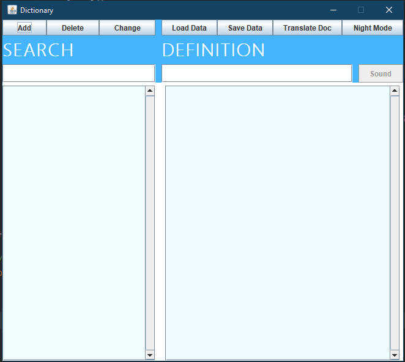

# dictionary_OOP_UET
Big Project, from FA boii, Students: Ngo Hai Dang and Pham Anh Dung

Just publish ultra super final version a few minutes ago (It's 10:37 PM 13/10/2020 now).
Add some java doc convention.

## Necessity: 
Need these libraries to run properly :3 :
  - sqljdbc42
  - jsoup-1.13.1
  - gson-2.8.2 
  - okio-1.6.0
  - okhttp-2.7.5 
  - json-simple-1.1
  
All below libaries are included from free tts:
  - cmu_time_awb 
  - cmu_us_kal
  - en_us
  - freetts-jsapi10
  - freetts
  - mbrola (not necessary)

## How to use ?
Run the DictionaryGUI.java file to execute the Dictionary.

## Text Translator issue
Can't run Text Translator, since you need an Microsoft Azure key to use Microsoft Translator API

## Word pronunciation issue 
Because the audio folder is too large and might cause lag when open Intellj, I won't combine it in project. You have to download it, then using load data method to bind it. Or using pronunciation in text Translator (although it sound super unnatural :( ).
